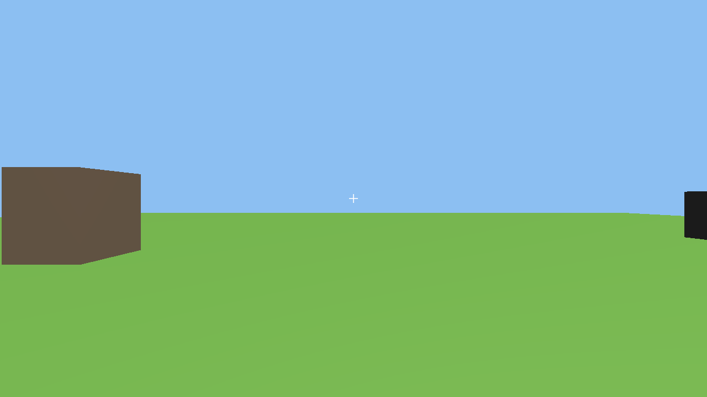
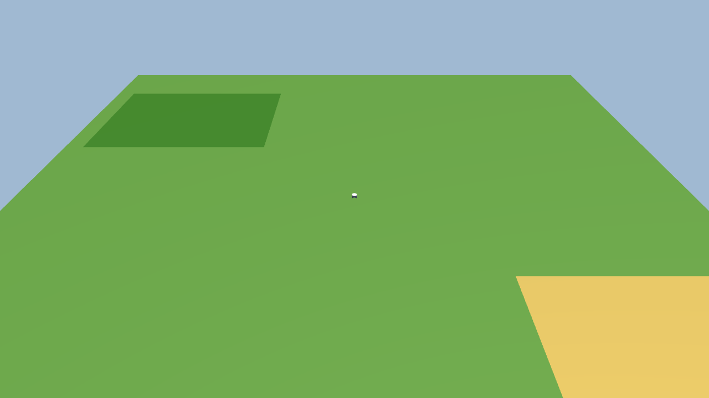
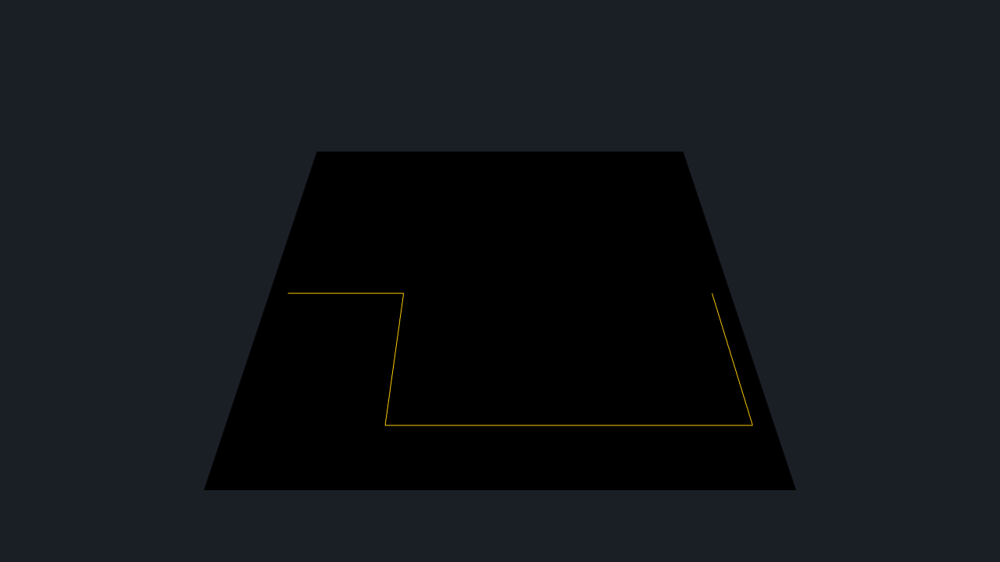

# Lucid-3D 回归视觉证据报告

**生成时间**: 2026-05-10
**生成方式**: `tsx scripts/regression-screenshot.ts --demo all --phase 57`
**Phase 58 KR3**

## 总览

| Example | 状态 | 截图 | 失败原因 |
|---------|------|------|----------|
| runner-3d | ✅ pass | [4 张](./phase-57/runner-3d/) | - |
| action-rpg | ✅ pass | [4 张](./phase-57/action-rpg/) | - |
| action-rpg-v2 | ✅ pass | [4 张](./phase-57/action-rpg-v2/) | - |
| br-12p | ✅ pass | [4 张](./phase-57/br-12p/) | - |
| slg-3d | ✅ pass | [4 张](./phase-57/slg-3d/) | - |
| tower-defense-3d | ✅ pass | [4 张](./phase-57/tower-defense-3d/) | - |

**6/6** examples 通过。所有 example 通过

## 截图缩略图

### runner-3d

   

### action-rpg

   

### action-rpg-v2

   

### br-12p

   

### slg-3d

   

### tower-defense-3d

   

## 已上传评论的 issue 清单（KR4 完成后填）

（待 KR4 完成后更新）
